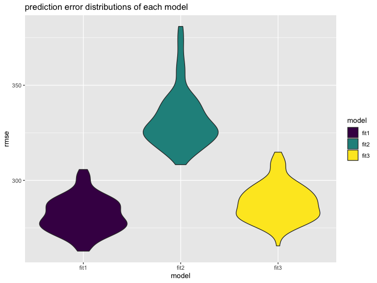

p8105\_hw6\_xw2676
================

## load and tidy the data

``` r
birthweight = read_csv("./dataset/birthweight.csv") %>% 
  janitor::clean_names() %>% 
  drop_na() %>% 
  mutate(
    babysex = factor(as.factor(babysex), levels = c(1,2), labels = c("male", "female")),
    frace = factor(as.factor(frace), levels = c(1,2,3,4,8,9), labels = c("white", "black", "asian", "puerto_rican", "other", "unknown")),
    malform = factor(as.factor(malform), levels = c(0,1), labels = c("absent", "present")),
    mrace = factor(as.factor(mrace), levels = c(1,2,3,4,8,9), labels = c("white", "black", "asian", "puerto_rican", "other", "unknown"))
  )
```

    ## Parsed with column specification:
    ## cols(
    ##   .default = col_double()
    ## )

    ## See spec(...) for full column specifications.

## Problem1

### Propose a regression model for birthweight.

I’d like to choose baby’s head circumference at birth, baby’s length at
birth, gestational age in weeks and baby’ sex as predictors. The reason
is that if the baby has larger head, longer length, higher gestational
age, it’s more likely that the baby is more heavier. And male neonates
are likely to be heavier than female neonates.

``` r
## add total variables as predictors
fit1_1 = lm(bwt~babysex+bhead+blength+delwt+fincome+frace+gaweeks+malform+menarche+mheight+momage+mrace+parity+pnumlbw+pnumsga+ppbmi+ppwt+smoken+wtgain, data = birthweight)
## use anova to check significance of every variable
anova(fit1_1)
```

    ## Analysis of Variance Table
    ## 
    ## Response: bwt
    ##             Df    Sum Sq   Mean Sq   F value    Pr(>F)    
    ## babysex      1   8547634   8547634  115.1324 < 2.2e-16 ***
    ## bhead        1 628838120 628838120 8470.1420 < 2.2e-16 ***
    ## blength      1 140213755 140213755 1888.6107 < 2.2e-16 ***
    ## delwt        1   8647158   8647158  116.4730 < 2.2e-16 ***
    ## fincome      1   4845845   4845845   65.2712 8.394e-16 ***
    ## frace        4  12713426   3178356   42.8109 < 2.2e-16 ***
    ## gaweeks      1   4500541   4500541   60.6201 8.605e-15 ***
    ## malform      1       529       529    0.0071  0.932737    
    ## menarche     1     51223     51223    0.6899  0.406230    
    ## mheight      1    535674    535674    7.2153  0.007256 ** 
    ## momage       1        51        51    0.0007  0.979114    
    ## mrace        3    682863    227621    3.0659  0.026879 *  
    ## parity       1    495627    495627    6.6759  0.009805 ** 
    ## ppbmi        1   2636579   2636579   35.5134 2.735e-09 ***
    ## ppwt         1    142438    142438    1.9186  0.166085    
    ## smoken       1   5076393   5076393   68.3765 < 2.2e-16 ***
    ## Residuals 4320 320724338     74242                        
    ## ---
    ## Signif. codes:  0 '***' 0.001 '**' 0.01 '*' 0.05 '.' 0.1 ' ' 1

``` r
## delete variables that are not significant
fit1_2 = lm(bwt~babysex+bhead+blength+delwt+fincome+frace+gaweeks+mheight+parity+pnumlbw+pnumsga+ppbmi+smoken+wtgain, data = birthweight)
## check again
anova(fit1_2)
```

    ## Analysis of Variance Table
    ## 
    ## Response: bwt
    ##             Df    Sum Sq   Mean Sq   F value    Pr(>F)    
    ## babysex      1   8547634   8547634  114.9369 < 2.2e-16 ***
    ## bhead        1 628838120 628838120 8455.7535 < 2.2e-16 ***
    ## blength      1 140213755 140213755 1885.4025 < 2.2e-16 ***
    ## delwt        1   8647158   8647158  116.2751 < 2.2e-16 ***
    ## fincome      1   4845845   4845845   65.1603 8.869e-16 ***
    ## frace        4  12713426   3178356   42.7382 < 2.2e-16 ***
    ## gaweeks      1   4500541   4500541   60.5171 9.058e-15 ***
    ## mheight      1    485434    485434    6.5275   0.01066 *  
    ## parity       1    482506    482506    6.4881   0.01089 *  
    ## ppbmi        1   2574412   2574412   34.6172 4.317e-09 ***
    ## smoken       1   4941723   4941723   66.4495 4.656e-16 ***
    ## wtgain       1    145342    145342    1.9544   0.16219    
    ## Residuals 4326 321716299     74368                        
    ## ---
    ## Signif. codes:  0 '***' 0.001 '**' 0.01 '*' 0.05 '.' 0.1 ' ' 1

``` r
## delete variables that are not significant
fit1 = lm(bwt~babysex+bhead+blength+delwt+fincome+frace+gaweeks+pnumlbw+pnumsga+ppbmi+smoken, data = birthweight)
## check again
anova(fit1)
```

    ## Analysis of Variance Table
    ## 
    ## Response: bwt
    ##             Df    Sum Sq   Mean Sq  F value    Pr(>F)    
    ## babysex      1   8547634   8547634  114.745 < 2.2e-16 ***
    ## bhead        1 628838120 628838120 8441.618 < 2.2e-16 ***
    ## blength      1 140213755 140213755 1882.251 < 2.2e-16 ***
    ## delwt        1   8647158   8647158  116.081 < 2.2e-16 ***
    ## fincome      1   4845845   4845845   65.051 9.364e-16 ***
    ## frace        4  12713426   3178356   42.667 < 2.2e-16 ***
    ## gaweeks      1   4500541   4500541   60.416 9.528e-15 ***
    ## ppbmi        1   2903251   2903251   38.974 4.708e-10 ***
    ## smoken       1   4963975   4963975   66.637 4.239e-16 ***
    ## Residuals 4329 322478489     74493                       
    ## ---
    ## Signif. codes:  0 '***' 0.001 '**' 0.01 '*' 0.05 '.' 0.1 ' ' 1

``` r
## done!
birthweight_model = modelr::add_residuals(birthweight, fit1) %>% 
  modelr::add_predictions(., fit1) 
ggplot(aes(x = pred, y = resid), data = birthweight_model) +
  geom_point() +
  geom_smooth(method = lm) +
labs(
  x = "fitted values",
  y = "residuals",
  title = "model residuals against fitted values"
) +
 geom_hline(yintercept = 0,col = "red",linetype = "dashed")
```


### Compare your model to two other

``` r
fit2 = lm(bwt~blength+gaweeks, data = birthweight)
summary(fit2)
```

    ## 
    ## Call:
    ## lm(formula = bwt ~ blength + gaweeks, data = birthweight)
    ## 
    ## Residuals:
    ##     Min      1Q  Median      3Q     Max 
    ## -1709.6  -215.4   -11.4   208.2  4188.8 
    ## 
    ## Coefficients:
    ##              Estimate Std. Error t value Pr(>|t|)    
    ## (Intercept) -4347.667     97.958  -44.38   <2e-16 ***
    ## blength       128.556      1.990   64.60   <2e-16 ***
    ## gaweeks        27.047      1.718   15.74   <2e-16 ***
    ## ---
    ## Signif. codes:  0 '***' 0.001 '**' 0.01 '*' 0.05 '.' 0.1 ' ' 1
    ## 
    ## Residual standard error: 333.2 on 4339 degrees of freedom
    ## Multiple R-squared:  0.5769, Adjusted R-squared:  0.5767 
    ## F-statistic:  2958 on 2 and 4339 DF,  p-value: < 2.2e-16

``` r
fit3 = lm(bwt~bhead+blength+babysex+bhead*blength+blength*babysex+babysex*bhead+bhead*blength*babysex, data = birthweight)
summary(fit3)
```

    ## 
    ## Call:
    ## lm(formula = bwt ~ bhead + blength + babysex + bhead * blength + 
    ##     blength * babysex + babysex * bhead + bhead * blength * babysex, 
    ##     data = birthweight)
    ## 
    ## Residuals:
    ##      Min       1Q   Median       3Q      Max 
    ## -1132.99  -190.42   -10.33   178.63  2617.96 
    ## 
    ## Coefficients:
    ##                               Estimate Std. Error t value Pr(>|t|)    
    ## (Intercept)                 -7176.8170  1264.8397  -5.674 1.49e-08 ***
    ## bhead                         181.7956    38.0542   4.777 1.84e-06 ***
    ## blength                       102.1269    26.2118   3.896 9.92e-05 ***
    ## babysexfemale                6374.8684  1677.7669   3.800 0.000147 ***
    ## bhead:blength                  -0.5536     0.7802  -0.710 0.478012    
    ## blength:babysexfemale        -123.7729    35.1185  -3.524 0.000429 ***
    ## bhead:babysexfemale          -198.3932    51.0917  -3.883 0.000105 ***
    ## bhead:blength:babysexfemale     3.8781     1.0566   3.670 0.000245 ***
    ## ---
    ## Signif. codes:  0 '***' 0.001 '**' 0.01 '*' 0.05 '.' 0.1 ' ' 1
    ## 
    ## Residual standard error: 287.7 on 4334 degrees of freedom
    ## Multiple R-squared:  0.6849, Adjusted R-squared:  0.6844 
    ## F-statistic:  1346 on 7 and 4334 DF,  p-value: < 2.2e-16

``` r
cv_df = crossv_mc(birthweight, 100)
cv_df =
  cv_df %>% 
  mutate(
    train = map(train, as_tibble),
    test = map(test, as_tibble))
cv_df = 
  cv_df %>% 
  mutate(fit1  = map(train, ~lm(bwt~babysex+bhead+blength+delwt+fincome+frace+gaweeks+pnumlbw+pnumsga+ppbmi+smoken, data = .x)),
         fit2  = map(train, ~lm(bwt~blength+gaweeks, data = .x)),
         fit3  = map(train, ~lm(bwt~bhead+blength+babysex+bhead*blength+blength*babysex+babysex*bhead+bhead*blength*babysex, data = .x))) %>% 
  mutate(rmse_fit1 = map2_dbl(fit1, test, ~rmse(model = .x, data = .y)),
         rmse_fit2 = map2_dbl(fit2, test, ~rmse(model = .x, data = .y)),
         rmse_fit3 = map2_dbl(fit3, test, ~rmse(model = .x, data = .y)))
cv_df_rmse = cv_df %>% 
  select(starts_with("rmse")) %>% 
  pivot_longer(
    everything(),
    names_to = "model", 
    values_to = "rmse",
    names_prefix = "rmse_") %>% 
  mutate(model = fct_inorder(model)) 
cv_df_rmse %>% 
  ggplot(aes(x = model, y = rmse)) + geom_violin() +
labs(
  x = "model",
  y = "rmse",
  title = "prediction error distributions of each model"
) 
```



``` r
cv_df_rmse %>% 
  group_by(model) %>% 
  summarise(
    mean_rmse = mean(rmse)
  ) %>% 
  knitr::kable(format = "html", align = 'c')
```

<table>

<thead>

<tr>

<th style="text-align:center;">

model

</th>

<th style="text-align:center;">

mean\_rmse

</th>

</tr>

</thead>

<tbody>

<tr>

<td style="text-align:center;">

fit1

</td>

<td style="text-align:center;">

273.8640

</td>

</tr>

<tr>

<td style="text-align:center;">

fit2

</td>

<td style="text-align:center;">

334.2863

</td>

</tr>

<tr>

<td style="text-align:center;">

fit3

</td>

<td style="text-align:center;">

289.5371

</td>

</tr>

</tbody>

</table>

According to the plot and table above, we can see that the rmse of the
model 1 is superior than the other two model.
